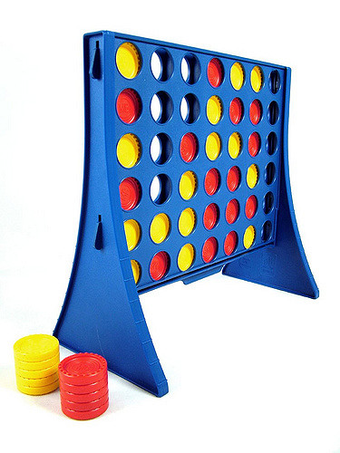
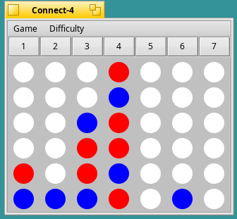

# Connect 4

*By Leo Chan, (c)1997*

**Connect 4, otherwise sometimes known as "Four in a Row", is a classic game usually played within a plastic frame, with the objective of getting 4 pieces of the same color adjacent to each other in any direction. This program is a recreation of the game in BeOS/Haiku software.**

*This is what Connect 4 looks like in real life. Photo credit: https://www.flickr.com/photos/unloveable/2396019222*

*This is what the game looks like in Haiku.*
